<!-- Visitor Log Tracker -->

  

<!-- Introduction -->
<h1 align="center">Hi, I'm Anupam 👋</h1>

  BCA Student • Open Source Enthusiast • Minimalist Dev

---

### 🧑‍💻 About Me

  -🚀 Focused on building powerful, minimal, and maintainable software 
- 🛠️ Strong believer in **Unix philosophy** — simplicity & minimalism 
- 🎯 Exploring **AI tools, cloud, and DevOps workflows** 
- 🌱 Currently learning **Express.js** and backend scaling 
- 📚 Anime fan | Hacker vibes | Dark mode everything 🌑   

---

### 🛠️ Skills

  
  
  
  
  
  
  
  
  
  
  
  
  
  

---
### 📊 GitHub Metrics

  

### 🐉 3D Contribution / Snake

  

---

### 📬 Connect

<a href="https://www.linkedin.com/in/unish06/">
    Linkedin
  </a> &nbsp;
  <a href="mailto:alinedtwins@gmail.com">Gmail
  </a> &nbsp;
  <a href="https://medium.com/@gomugomucode">Medium
  </a>&nbsp;

