<h1 align="center">Hi, I'm Anupam 👋</h1>

BCA Student • Open Source Enthusiast • Minimalist Dev

---

### 🛠️ Skills

  
  
  
  
  
  

---

### 📊 GitHub Metrics

  

---

### 🐉 3D Contribution Graph

  

---

### 🐍 Contribution Snake

  

---

### 📬 Connect

  <a href="https://github.com/gomugomucode">GitHub</a> •
  <a href="https://www.linkedin.com/in/YOUR_USERNAME/">LinkedIn</a> •
  <a href="https://twitter.com/YOUR_USERNAME">Twitter</a>

