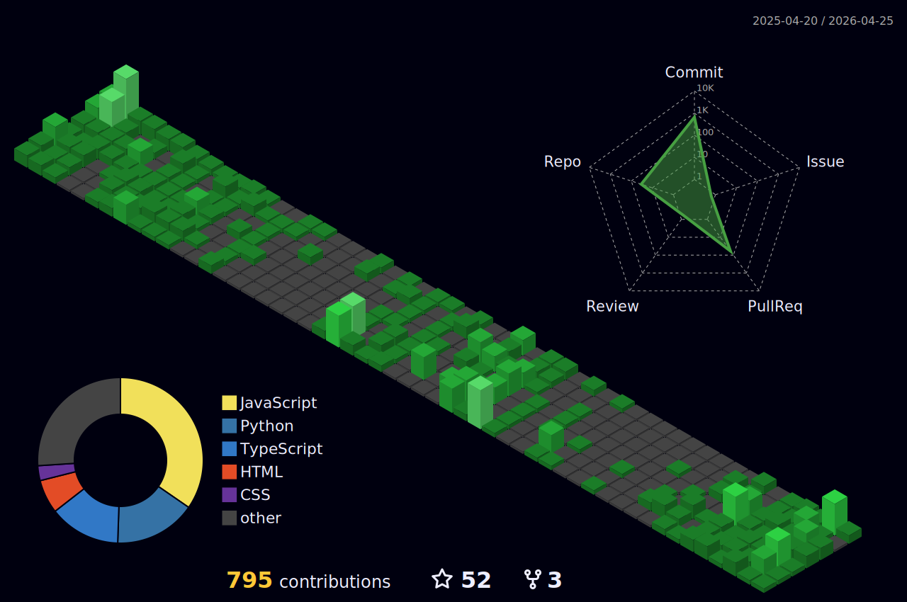

<!-- Visitor Log Tracker -->

  

  <h1 align="center">Hi, I'm Anupam </h1>

  <i>IT Student  • Python Enthusiast • Web System Builder</i>

  

---

### 🔭 Currently Exploring

* ⛓️ **Blockchain Development** – Building full-stack dApps and exploring the **Web3** ecosystem.
* 🐍 **AI/ML Integration** – Implementing Machine Learning models into Python-based web systems.

---

### 🛠️ Featured Projects

* [**ELearn**](https://github.com/gomugomucode/elearn) – Full-stack learning management system (Node.js, Express js , React, MySQL).
* [**Jarvis**](https://github.com/gomugomucode/Jarvis) – AI-driven automation assistant (Python).

---

### 📈 Contribution Activity

  

### 📊 GitHub Stats

---
### 🌐 Connect

  
  &nbsp;&nbsp;
  
  &nbsp;&nbsp;
  

  learning slowly • building honestly • growing with time

