  

  

<h1 align="center">Hi, I'm Anupam 👋</h1>

  Open Source Enthusiast | Developer | Minimalist 
  🧠 BCA Student | Dark Mode Evangelist 
  ⚡ Arch Linux | DWM / Hyperland / River 
  🎯 Minimalist Dev

---

## 📊 Metrics

  
  

  
  

---

## 🐉 3D Contribution Graph

  

---

## 🐍 Contribution Graph (Snake)

  

---

## 🧑‍💻 About Me

- 🚀 Focused on building powerful, minimal, and maintainable software  
- 🧘‍♂️ Combining modern tech stacks with a traditional Unix-style dev philosophy  
- 🛠️ I value elegance, speed, and the command line  
- 🌐 Projects: From intelligent virtual assistants to full-stack web platforms  
- 💻 Fluent in Python, Java, React, and the art of breaking & fixing  
- 👀 Seeking opportunities to collaborate and grow as a developer

---

## 🚀 Featured Projects

- [**Minimalist Portfolio**](https://github.com/gomugomucode/minimalist-portfolio)  
  A fast, dark-mode portfolio built with React and TailwindCSS. Features dynamic content, contact form, and mobile responsiveness.  
  *Tech used:* React, TailwindCSS, Versal

- [**CLI Virtual Assistant**](https://github.com/gomugomucode/Jarvis)  
  Unix-style assistant for automating daily tasks and system management.  
  *Tech used:* Python, Linux, API integrations

---

## 🛠️ Skills & Tools

**Languages:**  
Python • Java • C • JavaScript • PHP  

**Frontend:**  
React • TailwindCSS • HTML5 • CSS3  

**Backend & Database:**  
Node.js • Express.js • MySQL • REST APIs  

**Tools & OS:**  
Git • Linux (Arch, DWM, Hyperland) • Neovim • XAMPP  

  
  
  
  
  
  
  
  
  
  
  
  
  
  
  
  
  
  

---

## 📫 Connect With Me

  
  
  

